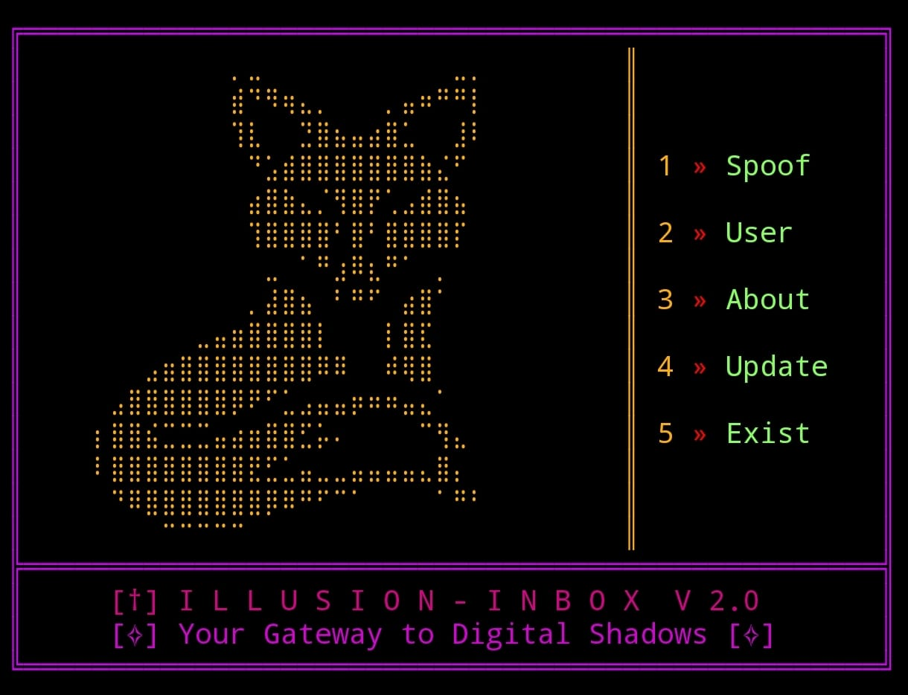

# 🎭 Illusion-Inbox v2.0 
<div align="center">




```diff
+ A sophisticated email spoofing simulation toolkit
- For educational and research purposes only
! Created by Team Illusion: KDO & Zork
```
</div>
## ⚠️ [ CRITICAL ADVISORY ]

```yaml
SECURITY PROTOCOLS:
    - Zero Tolerance: No abusive content allowed
    - Rate Limiting: Controlled operations
    - Protection: Built-in anti-malicious safeguards
    - Note: Cannot spoof emails from major domains (@gmail.com, @facebook.com, etc.)
```

## 🛠️ [ DEPLOYMENT SEQUENCE ]

### 🐧 Linux/Termux Installation
```bash
# Clone the matrix
git clone https://github.com/kdo2064/Illusion-Inbox.git

# Enter the void
cd Illusion-Inbox

# Initialize the system
# For regular Linux/Termux
python3 main.py

# For Parrot OS/Kali Linux
sudo python3 main.py
```

<div align="center">

> ⚡ **SYSTEM REQUIREMENTS**: Linux-based environments only | Windows incompatible ⚡

</div>

## ⚖️ [ LEGAL PROTOCOL ]

```diff
- WARNING: CONTROLLED EDUCATIONAL INSTRUMENT
! Email spoofing is prohibited by law
+ Research & demonstration only
@@ User assumes all legal liability @@
```

## 🚫 [ DISCLAIMER ]

<div align="center">

```
Team Illusion holds zero liability for unauthorized use
Operating this tool implies complete legal responsibility
```

</div>

## 👨‍💻 [ ARCHITECTS ]

<table align="center">
    <tr>
        <td align="center"><a href="https://github.com/kdo2064"></a></td>
        <td align="center"><a href="https://github.com/samay825"></a></td>
    </tr>
</table>

<div align="center">

---
*"In the world of bits and bytes, ethics light our path."*

</div>
